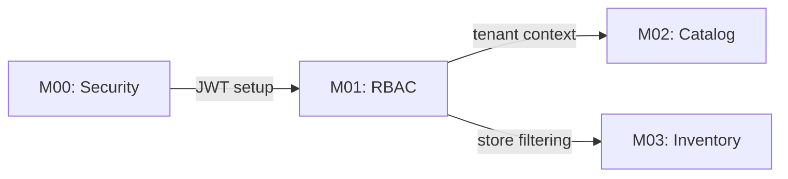

# 📊 Implementação Graphify + Vault Obsidian

**Data:** 21 de julho de 2026  
**Objetivo:** Integrar Graphify para visualizar dependências, gargalos e fluxos do projeto  
**Vault:** `E:\_Biblioteca\Notas Obsidian\Antenor e Filhos`  
**GitHub:** `https://github.com/Graphify-Labs/graphify`

---

## 1. O QUE É GRAPHIFY?

Graphify é uma ferramenta para visualizar relações entre notas em Obsidian através de **grafos interativos** que mostram:

```
Nós (Nodes):
├─ Documentos (INICIO_AQUI.md, STATUS.md, ROADMAP.md)
├─ Milestones (M01, M02, M03...)
├─ Componentes (Backend, Frontend, Admin)
├─ Pessoas (Dev roles, stakeholders)
└─ Tarefas (Tasks, PRs, bugs)

Arestas (Edges):
├─ Dependências (M01 bloqueia M02)
├─ Referências ([[wiki links]])
├─ Timeline (quando foi feito)
└─ Ownership (quem é responsável)
```

---

## 2. VANTAGENS PARA ESTE PROJETO

### 🎯 Visibilidade Instantânea

```
❌ Hoje (texto linear):
"M01 bloqueia M02, que bloqueia M03..."
(30s para entender)

✅ Com Graphify (grafo visual):
  M01 → M02 → M03 → M04
  (2s para entender)
```

### 📈 Detecção de Gargalos

```
Grafo mostra:
- M01 bloqueando 5 tarefas (nó vermelho = crítico)
- Componente Admin sem testes (amarelo = alerta)
- Task "Imagens de produto" isolada (cinza = órfã)
```

### 🔗 Rastreamento de Dependências

```
Ao clicar em "Checkout":
  └─ Vê que depende de:
     ├─ CartContext
     ├─ productPricing.ts
     ├─ Orders API
     └─ Delivery slots
  
  └─ E bloqueia:
     ├─ OMS
     ├─ Payments
     └─ Web Push
```

### 🚀 Planejamento Ágil

```
Vista temporal (timeline):
  [M01] ──→ [M02] ──→ [M03] ──→ [M04]
   ↓
Mostra quem fez, quando, status
```

---

## 3. ESTRUTURA NECESSÁRIA NO VAULT

### Organização Proposta (Obsidian)

```
Antenor e Filhos/
├─ Home.md (entrada principal)
├─ Dashboard.md (Graphify canvas)
│
├─ 00-Projeto/
│  ├─ INICIO_AQUI.md
│  ├─ STATUS.md
│  ├─ ROADMAP.md
│  ├─ MEMORIA_PROJETO.md
│  └─ Decisões Arquiteturais.md
│
├─ 01-Milestones/
│  ├─ M00-Security.md
│  ├─ M01-Tenant-RBAC.md
│  ├─ M02-Catalog.md
│  ├─ M03-Inventory.md
│  ├─ M04-Pricing.md
│  ├─ M05-Checkout.md
│  ├─ M06-OMS.md
│  ├─ M07-Picking.md
│  ├─ M08-Fulfillment.md
│  ├─ M09-Payments.md
│  ├─ M10-Integrations.md
│  ├─ M11-API-Public.md
│  ├─ M12-CRM.md
│  ├─ M13-BI-Analytics.md
│  ├─ M14-Observability.md
│  ├─ M15-Marketplace.md
│  ├─ M16-Recommendations.md
│  ├─ M17-Security-LGPD.md
│  ├─ M18-UX-UI.md
│  ├─ M19-B2B.md
│  ├─ M20-QA-Release.md
│  ├─ M33-Web-Push.md
│  └─ M39-Recipes.md
│
├─ 02-Componentes/
│  ├─ Backend/
│  │  ├─ NestJS-API.md
│  │  ├─ Auth-JWT.md
│  │  ├─ Products-Service.md
│  │  ├─ Orders-Service.md
│  │  ├─ Stock-Service.md
│  │  └─ Pricing-Service.md
│  │
│  ├─ Frontend/
│  │  ├─ Storefront.md
│  │  ├─ Home.md
│  │  ├─ ProductDetail.md
│  │  ├─ Cart.md
│  │  ├─ Checkout.md
│  │  ├─ CartContext.md
│  │  └─ productPricing.ts.md
│  │
│  └─ Admin/
│     ├─ Dashboard.md
│     ├─ Orders-Manager.md
│     ├─ Picking-Queue.md
│     └─ Analytics.md
│
├─ 03-Arquitetura/
│  ├─ Stack-Tecnologico.md
│  ├─ Database-Schema.md
│  ├─ API-Routes.md
│  └─ Deployment-Strategy.md
│
├─ 04-Riscos/
│  ├─ Crítico-Redis.md
│  ├─ Crítico-MeiliSearch.md
│  ├─ Crítico-Pagamentos.md
│  ├─ Moderado-Solidcom.md
│  └─ Baixo-Performance.md
│
├─ 05-Tasks/
│  ├─ Em-Progresso.md
│  ├─ Bloqueada.md
│  ├─ Concluída.md
│  └─ Backlog.md
│
├─ 06-Pessoas/
│  ├─ Equipe.md
│  ├─ Stakeholders.md
│  └─ Responsáveis.md
│
└─ 07-Timeline/
   ├─ 2026-Q2.md
   ├─ 2026-Q3.md
   ├─ 2026-Q4.md
   └─ Timeline-Geral.md
```

### Exemplo de Arquivo (M01-Tenant-RBAC.md)

```markdown
# M01: Multi-Tenant + RBAC

**Status:** ✅ Completo  
**Data:** 26/05/2026  
**Owner:** [[Equipe Backend]]  
**Depende de:** [[M00-Security]]  
**Bloqueia:** [[M02-Catalog]], [[M03-Inventory]]  
**Tempo estimado:** 40h  
**Tempo real:** 38h  

## Descrição
[[RODMAP]] aponta M01 como milestone de fundação RBAC.

## Tarefas
- [x] Models Prisma (Tenant, Store, Role, Permission)
- [x] Middleware TenantContext
- [x] Guards @RequirePermission()
- [x] Backfill tenant_id em tabelas legadas
- [x] Testes E2E

## Dependências


## Métricas
- Tests: 45/45 ✅
- Coverage: 92%
- Performance: +2% (indexes otimizados)

## Notas
- Backfill foi rápido (Prisma batch)
- Decidido usar row-level security ao invés de app-level (reversível)
```

---

## 4. PADRÕES DE WIKILINKS

### Conectar Notas (Graphify Usa Isso!)

```markdown
# Padrões recomendados para Graphify ler

## Links de Bloqueio
"[[M02-Catalog]] **depende de** [[M01-Tenant-RBAC]]"

## Links de Componente
"Implementado em [[Backend/Products-Service.md]]"

## Links de Risco
"[[Crítico-Redis.md]] impacta [[CartContext.md]]"

## Links de Timeline
"Começado em [[2026-Q2.md]]"

## Links de Ownership
"Responsável: [[Equipe Backend]]"

## Links de Feature
"Feature: [[M18-UX-UI.md]] → [[Home.md]] + [[ProductDetail.md]]"
```

---

## 5. SETUP DO GRAPHIFY NO OBSIDIAN

### Passo 1: Instalar Plugin

```
Obsidian → Settings → Community Plugins
→ Search "Graphify" (ou GraphView)
→ Install + Enable
```

### Passo 2: Criar Dashboard Canvas

```
Novo arquivo: Dashboard.md (raiz do vault)

Conteúdo:
# Antenor & Filhos — Dashboard Executivo

## 📊 Grafo de Milestones
![[graph-milestones.canvas]]

## 🔗 Dependências Críticas
![[graph-dependencies.canvas]]

## 🚨 Riscos + Impacto
![[graph-risks.canvas]]

## 📈 Timeline Visual
![[graph-timeline.canvas]]
```

### Passo 3: Configurar Filters

```
Graphify Settings:

Color by:
- Status (✅ Verde, 🟡 Amarelo, 🔴 Vermelho)
- Type (Milestone, Component, Risk, Task)
- Owner (Team Backend, Team Frontend, etc)

Layout:
- Hierarchical (milestones em cadeia)
- Force-directed (dependências complexas)
- Timeline (horizontal por data)

Link types:
- "depende de" = seta vermelha
- "bloqueia" = seta laranja
- "referencia" = seta cinza
- "owner" = seta azul
```

---

## 6. QUERIES ÚTEIS (GRAPHIFY SYNTAX)

### Visualizar Apenas Milestones Críticos

```
graph where tag:milestone AND status:blocked
```

### Mostrar Cadeia de Bloqueadores

```
graph where blocks:"M01" OR blocks:"M02" OR blocks:"M03"
```

### Riscos com Alto Impacto

```
graph where tag:risk AND impact:high
```

### Timeline de Próximas 2 Semanas

```
graph where date >= 2026-07-21 AND date <= 2026-08-04
```

### Componentes sem Owner

```
graph where tag:component AND owner:null
```

### Tudo que bloqueia Go-Live

```
graph where blocks:"Go-Live"
```

---

## 7. AUTOMAÇÃO COM FRONTMATTER

Adicionar ao topo de cada nota:

```yaml
---
title: M01: Multi-Tenant + RBAC
type: milestone
status: completed
date: 2026-05-26
owner: Backend Team
priority: critical
depends_on:
  - M00-Security
blocks:
  - M02-Catalog
  - M03-Inventory
time_estimated: 40
time_actual: 38
test_coverage: 92
risk_level: low
tags:
  - milestone
  - security
  - rdbac
---
```

**Vantagem:** Graphify lê frontmatter e filtra por status/owner/priority automaticamente.

---

## 8. CANVAS ESPECÍFICOS PARA CRIAR

### Canvas 1: Milestones em Cadeia

```
M00 → M01 → M02 → M03 → M04 → M05
      ↓       ↓      ↓      ↓
   [40h]  [35h]  [30h]  [25h]
   ✅    ✅     ✅     ✅
```

### Canvas 2: Componentes + Dependências

```
         ProductPricing.ts
              ↑
         CartContext ← [Frontend]
              ↓
         Orders API ← [Backend]
              ↓
         Stock Service
              ↓
         Solidcom ERP
```

### Canvas 3: Riscos Críticos

```
Redis ──────→ CartContext
 ↑             ↑
 │             └─ Checkout
 └───── Session Volatility
 
MeiliSearch ──→ Search
 ↑              ↑
 └─────── Busca lenta
 
Pagamentos ──→ Order Processing
 ↑             ↑
 └───── Gateway activation
```

### Canvas 4: Timeline (Q3 2026)

```
Semana 30 (21-27 Jul):
├─ Go-Live em Produção
├─ DNS + SSL
└─ Monitoring setup

Semana 31 (28 Jul - 03 Aug):
├─ Imagens de Produto
├─ Sitemap XML
└─ SEO metadata

Semana 32-36:
├─ Chatbot WhatsApp
├─ Marketplace
└─ Assinatura
```

---

## 9. QUERIES ÚTEIS PARA RELATÓRIOS

### Burndown de Milestones

```
Contar: [milestone] onde status = "completed"
Grafo mostra progresso visual
```

### Status de Componentes Críticos

```
Mostrar: CartContext, productPricing.ts, Orders API
Status: ✅ ✅ ✅ (verde = OK, vermelho = em risco)
```

### Dependências Não Resolvidas

```
Achar: notas com "depends_on" mas dependência não completada
Resultado: Bloqueia M02, M03, M04
```

### Owner Desigualmente Distribuído

```
Contar: tasks por owner
Backend: 120 tasks
Frontend: 45 tasks
Admin: 15 tasks
→ Resultado: Desbalanceado, rebalancear?
```

---

## 10. INTEGRAÇÃO COM VERSIONAMENTO

### Sincronizar Vault com GitHub

```bash
# No vault local (E:\_Biblioteca\Notas Obsidian\Antenor e Filhos)

# 1. Inicializar Git (se não tem)
git init

# 2. Adicionar remote
git remote add origin https://github.com/seu-user/antenor-notas.git

# 3. Commit + Push a cada mudança
git add -A
git commit -m "Update: M01 status, timeline ajustada"
git push origin main

# 4. No CI/CD (GitHub Actions):
# Ao fazer push, trigger:
# - Rebuild Graphify canvas
# - Notificar team no Slack
# - Gerar relatório de mudanças
```

---

## 11. TEMPLATES PARA CRIAR

### Template: Milestone (Nova nota)

```
# {{title}}

**Status:** 🟡 Em Progresso  
**Data Início:** {{date}}  
**Owner:** [[Seu nome]]  
**Depende de:** 

**Bloqueia:**  

---

## Objetivo
Breve descrição do que será feito.

## Tarefas
- [ ] Task 1
- [ ] Task 2
- [ ] Task 3

## Métricas
- Tests: x/y
- Coverage: %
- Perf impact: %

## Riscos
- [[Risco 1]]
- [[Risco 2]]

## Notas
Observações durante execução.
```

### Template: Risco

```
# {{title}}

**Severidade:** 🔴 Crítico  
**Probabilidade:** 60%  
**Impacto:** Alto  
**Deteção:** Imediata  

---

## Descrição
O que pode dar errado.

## Impacto se ocorrer
[[M01]], [[CartContext]], [[Checkout]]

## Mitigação
Como evitar ou reduzir.

## Monitoramento
Como detectar se está acontecendo.
```

---

## 12. ROTINA SEMANAL COM GRAPHIFY

### Segunda-feira (10:00)
```
1. Abrir Graphify Dashboard
2. Verificar status de cada milestone
   - Algum mudou de ✅ para 🟡?
   - Algum novo bloqueador apareceu?
3. Revisar riscos (vermelho)
   - Monitoramento alertou algo?
4. Atualizar frontmatter das mudanças
```

### Quinta-feira (14:00)
```
1. Reunião semanal: mostrar Graphify canvas
2. Identificar gargalos (nós com muitas arestas)
3. Rebalancear workload se needed
4. Atualizar timeline para próximas semanas
```

### Sexta-feira (17:00)
```
1. Gerar relatório: quantas tasks completas?
2. Atualizar ROADMAP.md com mudanças
3. Commit + Push ao repo de notas
4. Notificar time sobre status
```

---

## 13. GANHOS ESPERADOS

| Métrica | Antes | Com Graphify |
|---------|-------|-------------|
| **Descoberta de bloqueadores** | Manual (5-10min) | Automática (10s) |
| **Compreensão de dependências** | Texto (30s) | Visual (5s) |
| **Rastreamento de riscos** | Spreadsheet | Grafo com alerts |
| **Onboarding novo dev** | 2-3 horas | 30min (canvas visual) |
| **Detecção de tarefas órfãs** | Manual | Automática (nó isolado) |
| **Rebalanceamento de workload** | Difícil | Óbvio (owner node grande) |

---

## 14. PASSO A PASSO IMPLEMENTAÇÃO

### FASE 1: Setup (2 horas)
- [ ] Instalar Graphify plugin
- [ ] Criar estrutura de pastas no vault
- [ ] Migrar INICIO_AQUI.md, STATUS.md, ROADMAP.md para vault
- [ ] Criar Dashboard.md com referências

### FASE 2: Documentação (4 horas)
- [ ] Criar M00-M39 como notas individuais
- [ ] Adicionar frontmatter em cada nota
- [ ] Adicionar wikilinks (depende de, bloqueia, referencia)
- [ ] Criar arquivos de risco (04-Riscos/)

### FASE 3: Visualização (3 horas)
- [ ] Criar 4 canvas principais (Milestones, Dependências, Riscos, Timeline)
- [ ] Configurar filtros (status, owner, priority)
- [ ] Testar queries (mostrar apenas crítico, apenas bloqueado, etc)

### FASE 4: Automação (2 horas)
- [ ] Sincronizar com GitHub
- [ ] Criar GitHub Actions para rebuild de canvas
- [ ] Setup notificações (Slack ao atualizar status crítico)

### FASE 5: Rotina (Ongoing)
- [ ] Atualizar notas toda segunda (status check)
- [ ] Reunião quinta com dashboard (Graphify canvas)
- [ ] Commit sexta-feira

---

## 15. RECOMENDAÇÃO

### ✅ IMPLEMENTE JÁ

**Por quê?**
- Projeto tem 20+ milestones (difícil de rastrear mentalmente)
- Múltiplas dependências críticas (Redis, MeiliSearch, Solidcom)
- Tim disperso (pode perder contexto)
- Próxima fase é Go-Live (precisa visibilidade máxima)

**Timeline:** 2-3 horas de setup, ROI imediato.

**Próximos passos:**
1. Instalar Graphify (5 min)
2. Criar estrutura (30 min)
3. Migrar notas críticas (1 hora)
4. Criar canvas principal (1 hora)
5. Compartilhar com time (15 min)

---

*Proposta pronta em 21 de julho de 2026*  
*Foco: Visibilidade de dependências antes de Go-Live*
